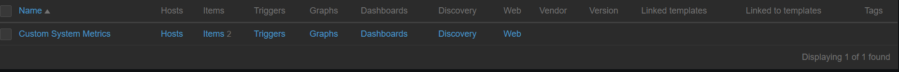
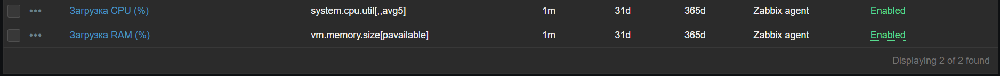
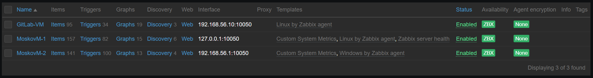
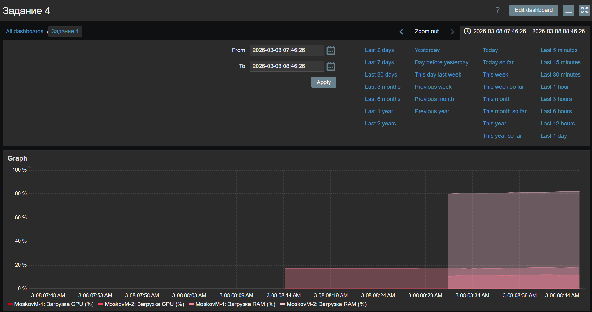
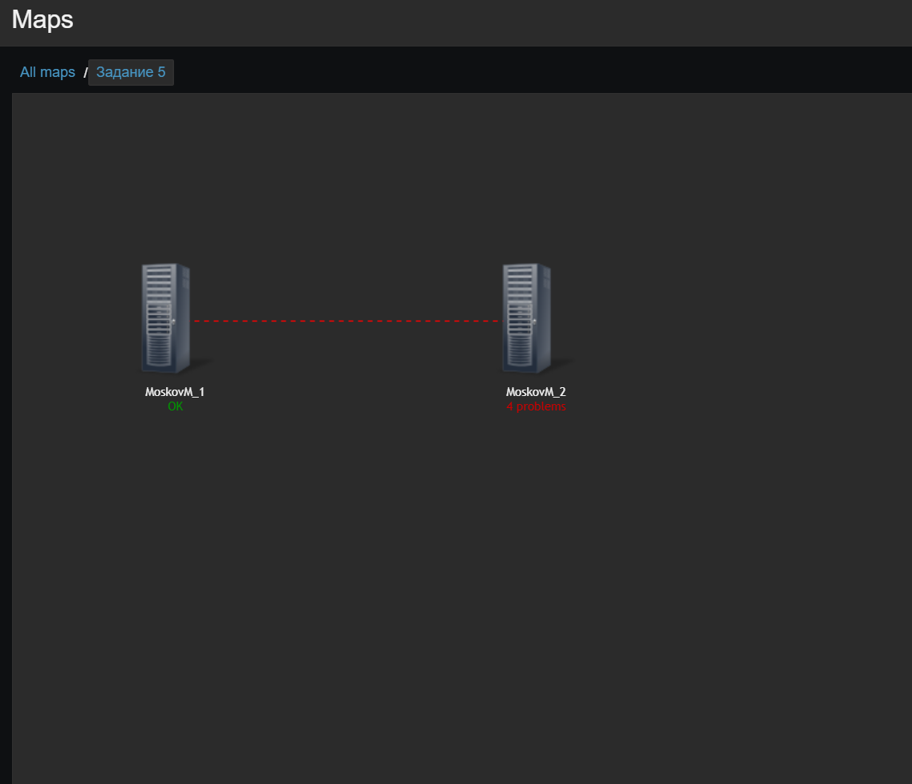
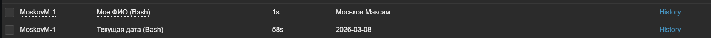

# Домашнее задание к занятию "`Система мониторинга Zabbix. Часть 2`" - `Моськов Максим`

### Задание 1: Создан шаблон `Custom System Metrics` с элементами данных для сбора % загрузки CPU и RAM.





### Задание 2 и 3: В качестве хостов использованы виртуальные машины из прошлого ДЗ. Имена изменены на требуемые. К хостам успешно привязаны стандартный шаблон Linux и созданный кастомный шаблон. Метрики поступают.



### Задание 4: Создан кастомный дашборд с выводом графиков потребления ресурсов.



### Задание 5*: Создана топологическая карта сети. Между хостами настроена связь с индикатором триггера `Zabbix agent is not available`. При выключении агента на одном из хостов, триггер успешно срабатывает, меняя линию на красную пунктирную.



### Задание 6* со звездочкой

**Выполнение:**
Был написан Bash-скрипт, принимающий аргументы на вход. В конфигурационный файл Zabbix-агента (`zabbix_agentd.conf`) добавлен параметр `UserParameter` для вызова этого скрипта сервером. В веб-интерфейсе (в созданном ранее шаблоне) добавлены два элемента данных с ключами `custom.script[1]` и `custom.script[2]` и типом информации `Character`.



**Код Bash-скрипта (`/etc/zabbix/scripts/my_script.sh`):**
```bash
#!/bin/bash
if [ "$1" == "1" ]; then
    echo "Москов Максим"
elif [ "$1" == "2" ]; then
    date "+%Y-%m-%d"
else
    echo "Unknown parameter"
fi 


